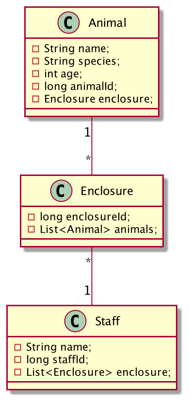

# Klausner Zooverwaltung
https://2122-5ahitm-sew.github.io/01-microproject-floklausner

## The idea of this project 

The idea of this Project is to build a quarkus backend where you are able to manage Enclosures of Animals

## Class Diagramm

